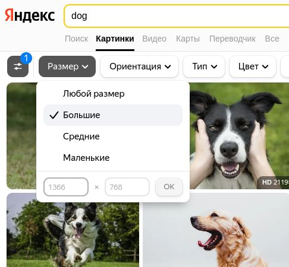
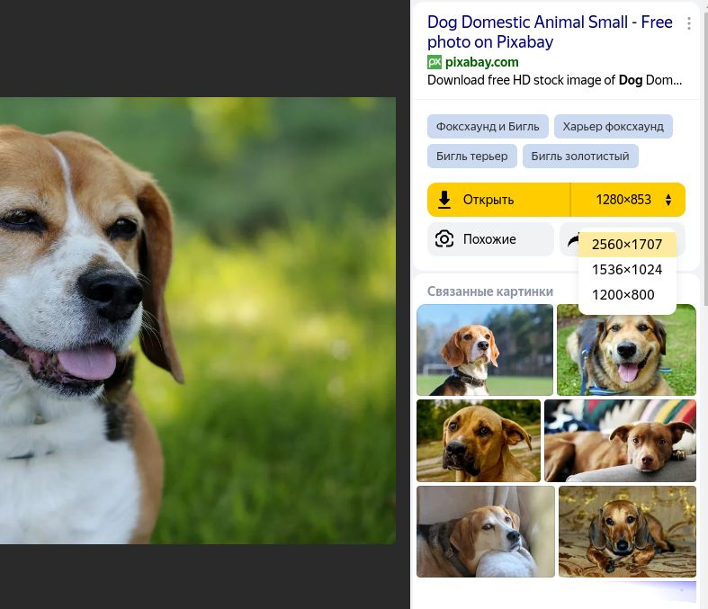
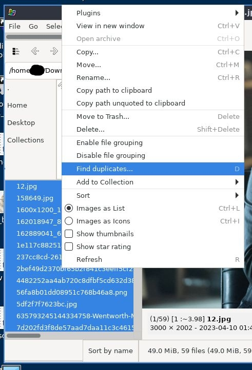
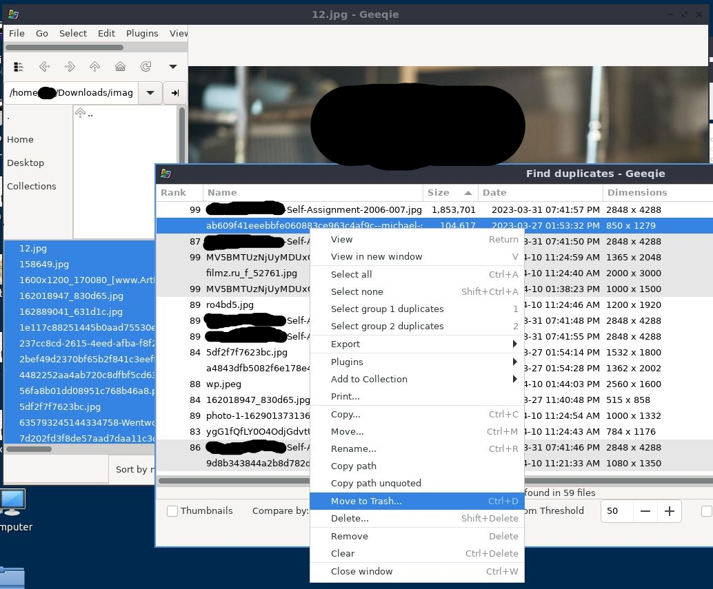

# Current LoRA workflow

Most of my public LoRA's are here: https://civitai.com/user/chairfull

|Model|Images Used|Note|
|-----|:---------:|----|
|[Josh Brolin](https://civitai.com/models/33629/josh-brolin)|19|Fewest images used.|
|[Guy Pierce](https://civitai.com/models/23993/guy-pierce)|32|Used CLIP instead of BLIP.|
|[Woody Harrelson](https://civitai.com/models/42418/woody-harrelson)|38|First model I used regularisation images on.|
|[Jack Nicholson](https://civitai.com/models/23994/jack-nicholson)|52|Most downloaded [Male].|
|[Kelly Brook](https://civitai.com/models/23990/kelly-brook)|146|Captioned with CLIP Interrogator 2.1 at `best` setting. For most models I use BLIP.|
|[Anne Hathaway](https://civitai.com/models/26164/anne-hathaway)|147|Most downloaded.|
|[Maitland Ward](https://civitai.com/models/26187/maitland-ward)|325|Most images used.|

## 1) Training Data

Image quality = Model quality.

Image quantity = Model flexibility.

Image quality is a big part in how well a LoRA turns out, so try to find the highest quality images you can.

Many images I've used are over 2000x3000. Some >8000x5000.
I only crop out other people and text. I don't resize.

High quality image **!=** big image.  A high quality is one where if you zoom in you see details like skin pores, eye flecks, fabric threads.

If you zoom in and it looks blurry, that image is someones crummy upscale. Using too many of those images in training will give the model a cartoon airbrush look.

### Finding images

#### (Optional) Chrome extensions
[Imagus](https://chrome.google.com/webstore/detail/imagus/immpkjjlgappgfkkfieppnmlhakdmaab?hl=en): See full image by hovering it or a link, and hit `Ctrl+S` to save it.

[Double Click Image Downloader](https://chrome.google.com/webstore/detail/double-click-image-downlo/bkijmpolkanhdehnlnabfooghjdokakc/?hl=en): For quicker downloading.

[YouTube Screenshot Button](https://chrome.google.com/webstore/detail/youtube-screenshot-button/ehehmcocpegbmagfhajbmeofolnpdfla?hl=en): Make sure to set the video quality to HD, as high as you can set it.
Pause a video and use `,` and `.` keys to move back/forward one frame, to find the least blurry frame.

[UBlockOrigin](https://chrome.google.com/webstore/detail/ublock-origin/cjpalhdlnbpafiamejdnhcphjbkeiagm?hl=en): Nicest adblocker, imo.

#### Sources
[Yandex](https://yandex.ru/images/search?isize=large&text=dog)
This is my goto. Better than Google's image search. Allows easilly finding in different size.  

1) Search your subject.

2) Sort images by largest


3) On the right is a size drop down, attempt to find the biggest.

Only do this if the largest is actually better quality. It may be an crummy upscale, or the link may not work.

You can also search for better quality images by dragging them into Yandex, to do a `Similar image search`.

I'm now using YouTube, and it works quite well. Get a [YouTube screenshot chrome extension](https://chrome.google.com/webstore/detail/ublock-origin/cjpalhdlnbpafiamejdnhcphjbkeiagm?hl=en) and use `,` `.` to find unique facial angles that aren't blurry. (Be sure to set video quality to highest possible.)

For a person, attempt to find **at least** one of each:
- Profile left + profile right.
- 3/4 left + 3/4 right.
- Looking at camera.
- Looking up + looking down.
- (Bonus) Looking up + down at 3/4 left and right.
- (Bonus) All these angles with multiple expressions (happy, neutral, angry)

### Processing images

#### Dealing with duplicates
While looking for images I save as many as look decent. Sometimes coming across higher quality versions later. So I end up with duplicates.

To remove duplicates I use [Geeqie Image viewer](https://www.geeqie.org).

Open Geeqie and go to your folder of images.

Select all of them in the lower right panel.

`Right Click` and select `Find duplicates`.  


Sort on `Similarity`, (low, med, high).

If it finds any, get rid of whichever ones seem lower quality, by `Right Clicking` and selecting `Delete`.  


#### Bulk Cropping
Select the few images that need cropping and drag into [bulkimagecrop.com](https://bulkimagecrop.com/).

While I try to remove other similar subjects (other males, if training on a male), and text, I don't try to center the subject.
Having the subject dead center in every image could train the model to think you always want that.

I have the subject be on far left, far top, bottom right...

Once you've cropped and downloaded the images to zips, you can mass unzip with: `unzip \*.zip`

### Zip
Zip the images: `zip ./my_pics -r .`

### Upload
- Upload the zip to your Google drive.
- `Right Click` it in GDrive, select `Share` or `Get link`.
- Toggle `Make Public`.
- Click `Copy link`.

## 2) Kohya
I used: https://github.com/Linaqruf/kohya-trainer (Dreambooth method, top one.)

I use the Google colab version as my GPU sucks, but I assume it works the same if you run it on your pc.

I mostly BLIP to auto caption the images.  
Recently I started upping the word count from `15-75` to `30-100`, and the results have seemed a tinge better?

Leave pretty much all the settings values at their default, except:
  * For pre trained model download: `Stable-Diffusion-v1-5`.
  * For VAE model download: `stablediffusion.vae.pt`
  * Set `pretrained_model_name_or_path` to `/content/pretrained_model/Stable-Diffusion-v1-5.safetensors`
  * Set `vae` to `/content/vae/stablediffusion.vae.pt`
  * Set `class_token` to `man`.

# Experiments

Random ideas I'm trying out:

## Regularization images
I've tried all different methods with regularisation images and don't find them that great.
Maybe I'm doing something wrong.

For this [Woody Harrelson](https://civitai.com/models/42418/woody-harrelson) model, I used all the photos of males that I've trained other models with, as regularization data. Didn't crop anything or care about aspect ratio. It seems Kohya will bucket them. Everything worked fine.

## Higher quality through tokens
Tokens, in the captions, are what you **don't** want trained as part of your model, with the exception of the `class_token`:  
So for a man: `a man, in a red hat, in a forest` would only extract the `man` not the `red hat` or `forest`.  
Theoretically, this should work for style and image quality, so for old images I might add: `blurry, old image, scan, jpeg artifacts, low quality` in hopes the model will pull a sharper image.

## CLIP instead of BLIP
For [this model](https://civitai.com/models/23990/kelly-brook) I captioned 146 images with CLIP Interrogator 2.1 on the `best` setting.

It took a long time, and I don't know that it was worth it. Theoretically it should be more flexible than other models. Needs more testing.

## Sentiment analyzer for better facial expressiveness
To get more expressiveness out of training data, I'm going to try a [sentiment analyzer](https://huggingface.co/spaces/schibsted/facial_expression_classifier) on a set of photos.

Maybe instead of a single subject, I will train a ton of random faces of emotions at different angles, and then caption each like
```
img1.png: a man on the beach, neutral_90 sad_20 fear_5 happy_3
img2.png: a woman at work, happy_40 neutral_20 sad_9
```
